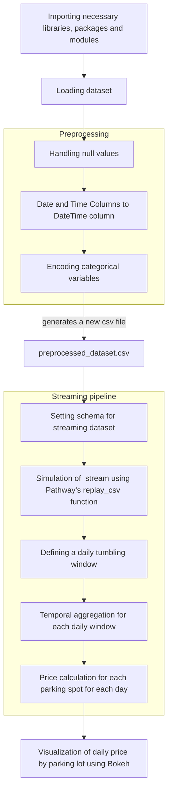

```mermaid
  flowchart TB
    subgraph Preprocessing 
      HNV["Handling null values"] --> DTC["Date and Time Columns to DateTime column"] --> ECV["Encoding categorical variables"]
    end

    subgraph Streaming pipeline
      S["Setting schema for streaming dataset"] --> Sm["Simulation of  stream using Pathway's replay_csv function"] --> DT["Defining a daily tumbling window"]--> TA["Temporal aggregation for each daily window"]--> PC["Price calculation for each parking spot for each day"]
    end
   
   IL["Importing necessary libraries, packages and modules"] --> LD["Loading dataset"]

   LD["Loading dataset"] --> HNV["Handling null values"]

   ECV["Encoding categorical variables"] --"generates a new csv file"--> PD["preprocessed_dataset.csv"]

   PD["preprocessed_dataset.csv"] --> S["Setting schema for streaming dataset"] 

   PC["Price calculation for each parking spot for each day"] --> BV["Visualization of daily price by parking lot using Bokeh"]

    

```